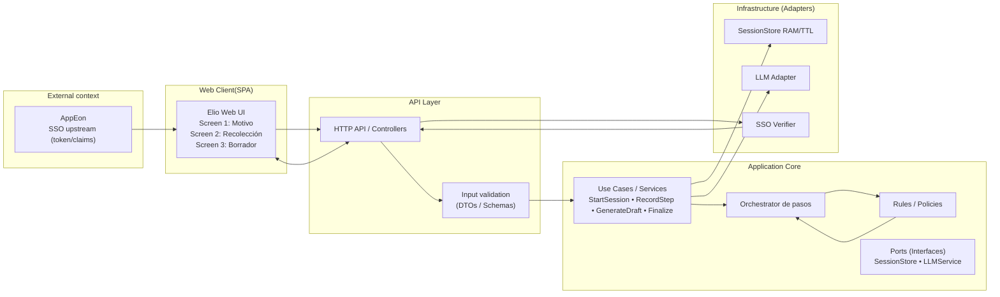
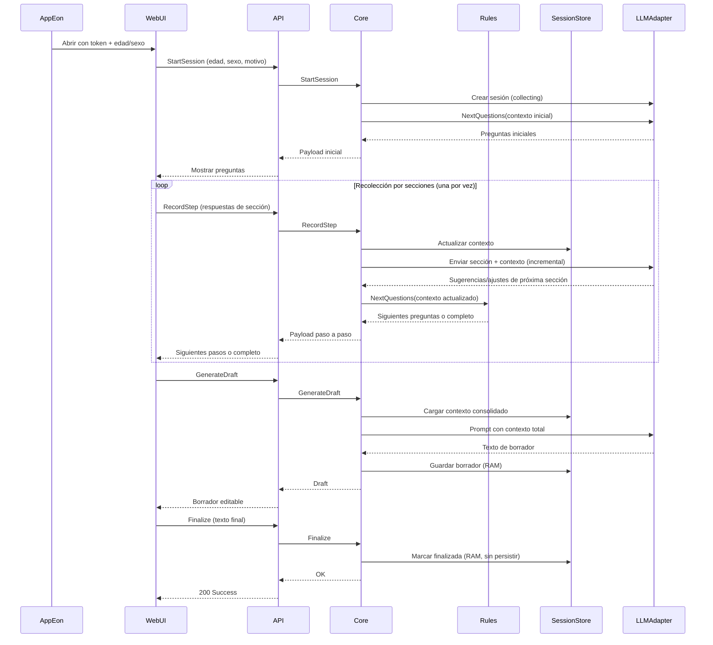

# Elio

Elio is a tool that allows medical consultations to be recorded in a more accessible, convenient, and efficient way. It automates the creation of clinical diagnostic reports so that doctors don’t have to write everything from scratch.

This will save time, produce a more organized record, and later provide the ability to generate statistical samples of cases, disease, and clinical diagnostic.

## Table of Contents

1. [User Stories and Mockups](#1-user-stories-and-mockups)
2. [System Architecture](#2-system-architecture)
3. [Components, Classes, and Database Design](#3-components-classes-and-database-design)
4. [Sequence Diagrams](#4-sequence-diagrams)
5. [API Specifications](#5-api-specifications)
6. [Source Control Management (SCM) and Quality Assurance (QA) Strategies](#6-scm-and-qa-strategies)
7. [Technical Justifications](#7-technical-justifications)


## 1. User Stories and Mockups

### 1.1 Prioritized User Stories (MoSCoW)

#### Must Have

- As a physician, I need record my consultations in the most accessible, comfortable, and efficient way possible, to dedicate more time to the patient observation, rather than filling out forms.

### 1.2 Mockups

[Elio User Interface](https://www.figma.com/proto/GKUrCkbEFd4LLeZqOR6X9h/Elio?node-id=147-368&p=f&t=OtDCn1gyjt3f2z4H-0&scaling=min-zoom&content-scaling=fixed&page-id=147%3A368)


## 2. System Architecture

### 2.1 Architecture Diagram

##### Fig. 2 Architecture Diagram



### 2.2 Component Description

| Components | Tecnology | Description |
|-----|-----------|----------------------|
| Frontend   | Angular (Web - Framework) | SPA - Single Page Application |
| Backend    | Node.js | Server Technology |
| Database | MongoDB | Storing, managing, and retrieving data such as SNOMED CT codes & VADEMECUM names |
| External Services | Gemini 2.5 & MongoDB | Gemini API for content generation and text embedding. MongoDB for storing, managing, and retrieving data |

## 3. Components, Classes, and Database Design

### 3.1 Main Components and Classes

#### Back-end

**1. Controller (flow handler)**  
Acts as the central orchestrator: decides which sub-endpoint to call, updates the in-memory model, and coordinates the interaction with the AI before returning a response to the frontend. It is the core of the loop.

- **Attributes:**
  - `PasoActual`: string (`"consulta"`, `"antecedentes"`, etc.)  
  - `PatientID`: ID of the session/patient received from AppEon  
  - `PartialState`: JSON object storing the incremental state (instance of `ClinicalSummary`)  

- **Methods:**
  - `nextStep(input)`: receives the response from the frontend and decides which section to move to.  
  - `savePartialState(data)`: stores info in temporary memory (not persisted in DB).  
  - `getSuggestions(step)`: queries Gemini for contextualized options.  
  - `buildSummary()`: builds the final JSON (`clinicalSummarySchema`).  

---

**2. AIService (Gemini service)**  
Handles communication with Gemini Flash 2.5.

- **Attributes:**
  - `model`: Gemini Flash 2.5  
  - `context`: partial patient state (JSON or Markdown)  

- **Methods:**
  - `generateOptions(step, context)`: returns suggested responses for a given section.  
  - `summarizeCase(context)`: generates the complete clinical draft (editable).  

---

**3. Model (central structure)**  
Represents the clinical state of the consultation during the session.

```json
{
  "consulta": "Dolor en primer dedo pie derecho...",
  "antecedentes": ["HTA", "Diabetes"],
  "alergias": ["Penicilina"],
  "farmacos": ["Metformina"],
  "anamnesis": "Paciente refiere dolor progresivo...",
  "examenes_fisicos": "Eritema e impotencia funcional en 1° dedo...",
  "resumen": "Paciente masculino de 50 años con cuadro compatible con..."
}
```

## 4. Sequence Diagrams

### 4.1 Create medical note



## 5. API Specifications

### 5.1 External APIs

| API | Purpose | Justification |
|-----|-----------|---------------|
| Google Gemini 2.5 | Content generation & Text embedding | It's the industry's standard to generate text together with OpenAI and it's free to use |
| MongoDB | To allocate and search for VADEMECUM & SNOMED CT data | We know how to use it |

### 5.2 Internal API

#### Backend Endpoints

| Route | HTTP Method | Description | Input Parameters | Output Format |
|------|-------------|-------------|----------------------|-------------------|
| `/api/init` | GET | Age, Gender | `String, Number` | ```json { "Age": x, "Gender": "x" }``` |
| `/api/init` | POST | Age, Gender, Motivo_consulta | `String, Number,` | ```json { "Age": x, "Gender": "x", "Motivo_consulta": "x" }``` |
| `/api/collect` | GET | Read state? | `json` | ```json``` |
| `/api/collect` | POST | Submit step answers | `json` | ```json``` |
| `/api/crear_nota` | GET | Read draft? | `json` | ```json``` |
| `/api/crear_nota` | POST | Generate draft | `json` | ```json``` |
| `/api/edit` | GET | Read draft? | `json` | ```json``` |
| `/api/edit` | PUT | Save edited draft | `json` | ```json``` |
| `/api/end` | POST | Finalize session | `json` | ```json``` |

## 6. SCM and QA Strategies

### 6.1 Version Control Management (SCM)

#### Tool
- **System**: Git  
- **Platform**: GitHub  

#### Branch Strategy
- **main (Ask):** Contains only approved code ready for deployment.  
- **develop (Ask):** Integration branch where the complete system is reviewed before moving to production.  
- **test (Show):** Testing branch where backend and frontend are integrated to validate joint functionality.  
- **backend (Show):** Backend working branch where API progress is shown.  
- **frontend (Show):** Frontend working branch where interface progress is shown.  
- **feature/[name] (Ship):** Temporary sub-branches to implement specific features (e.g., `feature/login-backend`, `feature/dashboard-frontend`).  

#### Development Process
1. Create a `feature/[name]` branch from `backend` or `frontend`.  
2. Develop the feature and make descriptive commits.  
3. Merge into `backend` or `frontend` (Show).  
4. Integrate into `test` (Show) to validate backend + frontend together.  
5. Merge into `develop` (Ask), subject to code review.  
6. Manual QA and critical validations in `develop`.  
7. Final merge into `main` (Ask) for production deployment.  

#### Rules
- Never merge Show branches directly into `main`.  
- All merges into `develop` and `main` must be done via Pull Requests on GitHub with peer review.  
- Commits must be descriptive and follow a consistent format.  
- `main` must always be stable and ready for immediate deployment.  

---

### 6.2 Quality Assurance (QA)

#### Test Types
- **Unit Tests:** Validate critical backend and frontend functions and classes.  
- **Integration Tests:** Validate interaction between backend and frontend in the `test` branch.  
- **API Tests:** Validate endpoints using dedicated tools.  
- **UI Tests:** Validate user interface flows.  
- **Manual QA:** Review of critical use cases in `develop`.  
- **Code Reviews:** All Pull Requests into Ask branches (`develop` and `main`) must be approved by at least one other team member.  

#### Tools
- **Backend (Unit Tests):** Jest / Mocha  
- **Frontend (UI/Integration):** Jasmine testing framework
- **API Testing:** Postman / Thunder Client  
- **CI/CD:** GitHub Actions to run automated tests on every Pull Request  

#### Code Coverage
- **Goal:** >80% coverage in critical code.  
- **Tools:** Jest (coverage report) and Cypress (for e2e).  

#### QA Process
1. Automatic execution of unit tests on every push to a sub-branch (Ship).  
2. Integration tests when merging into `backend`/`frontend` (Show).  
3. API and UI tests in `test` before merging into `develop`.  
4. Manual QA and mandatory code review in `develop`.  
5. Merging into `main` triggers automatic deployment to production if all validations pass.  

## 7. Technical Justifications

### 7.1 Technology Choices

| Technology	| Alternatives Considered | Justification |
|----------|--------------|---------------|
| Angular | React | Angular provides more scalability |
| Node.js | Python & Fastapi | Frontend and backend are created in a single languaje |

### 7.2 Technology Choices

| Decision | Alternatives | Justification |
|-----|-----------|----------------------|
| MCP Architecture | Monolith Architecture | Separation of flow control, state and persistence for more scalability |
| Jwt Authentication | None | Technology that we know how to handle |

### 7.3 Scalability and Maintenance Considerations

- Interface - Angular: Their premise is to be scalable and maintainable
- Backend - Node.js: Having all the codebase in JS - TS makes the code easier to work with, given that it's on a single language

## Appendices

### Glossary of Terms

| Term | Definition |
|---------|------------|
| RAG | Technique that enables large language models to retrieve and incorporate new info |
| MCP | (Master Control Program) architecture is a system design where a central program manages and controls all resources and processes in a computer |
| show/ship/ask | Structured way to share work in GitHub |


### References
- [Node.js](https://nodejs.org/): Node.js® is a free, open-source, cross-platform JavaScript runtime environment that lets developers create servers, web apps, command line tools and scripts.
- [Angular](https://angular.dev/): Angular is a development platform for building mobile and desktop web applications using TypeScript/JavaScript.
- [MongoDB Atlas](https://www.mongodb.com/products/platform): MongoDB Atlas is a fully managed, multi-cloud database-as-a-service (DBaaS) built on MongoDB's flexible document model that simplifies the deployment, operation, and scaling of global applications.
- [TypeScript](https://www.typescriptlang.org/): TypeScript is a strongly typed superset of JavaScript that adds optional static type checking to the language. It was developed to address the shortcomings of JavaScript, particularly in large-scale application development.
