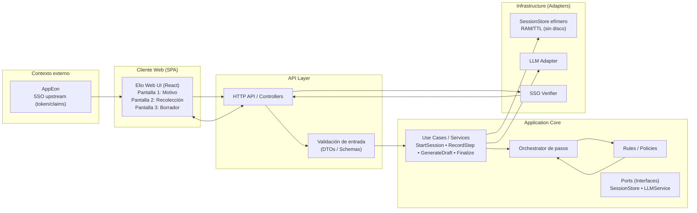

<div align="right">
  
</div>
<hr style="border-top: 2px solid #000;">

# Final Proyect ELIO

## Table of Contents

1. User Stories and Mockups
2. System Architecture
3. Components, Classes, and Database Design
4. Sequence Diagrams
5. API Specifications
6. Source Control Management (SCM) and Quality Assurance (QA) Strategies
7. Technical Justifications


## 1. User Stories and Mockups

### 1.1 Prioritized User Stories (MoSCoW)

#### Must Have

- As a physician, I need record my consultations in the most accessible, comfortable, and efficient way possible, to dedicate more time to the patient observation, rather than filling out forms.

### 1.2 Mockups

[Fig. 1 Elio UI](https://www.figma.com/proto/GKUrCkbEFd4LLeZqOR6X9h/Elio?node-id=147-368&p=f&t=OtDCn1gyjt3f2z4H-0&scaling=min-zoom&content-scaling=fixed&page-id=147%3A368)


## 2. System Architecture

### 2.1 Architecture Diagram

##### Fig. 2 Architecture Diagram



### 2.2 Component Description

| Componente | Tecnología | Descripción |
|-----|-----------|----------------------|
| Frontend   | [Angular (Web - Framework)] | [SPA - Single Page Application] |
| Backend    | [Node.js] | [Server Technology] |
| Database | [MongoDB] | [Database para cargar datos de SNOMED CT & VADEMECUM] |
| External Services | [Gemini 2.5 & MongoDB] | [Api para redaccion y generacion de opciones & MongoDB para consultar datos] |

### 2.3 Data Flow

Tenemos que describir cómo fluyen los datos entre los diferentes componentes de nuestro sistema


## 3. Components, Classes, and Database Design

### 3.1 Main Components and Classes

#### Back-end
Listado y descripción de las clases principales, sus atributos y métodos

#### Front-end

Listado de los componentes principales de la interfaz de usuario y sus interacciones

### 3.2 Database Design

Elegir uno según lo que necesitemos, A o B, borrar la A o la B y dejar solamente la opción

#### Option A: ER Diagram (for relational databases)

Aquí ponemos un diagrama ER que muestre tablas, atributos y relaciones si existen


#### Option B: Collection Structure (for NoSQL databases)

**Collection: users**

```json
{
  "_id": "ObjectId",
  "name": "String",
  "email": "String",
  "password": "String (hashed)",
  "createdDate": "Date",
  "lastAccess": "Date"
}
```
si necesitan mas colecciones las siguen poniendo aca abajo especificando que tipo de colección es


## 4. Sequence Diagrams

### 4.1 Critical Use Case 1: Authentication Process (es un ejemplo)

Aquí ponemos un diagrama de secuencia para este caso de uso


### 4.2 Critical Use Case 2: New Resource Creation (otro ejemplo)

Aquí ponemos un diagrama de secuencia para este caso de uso


## 5. API Specifications

### 5.1 External APIs

| API | Purpose | Endpoints Used | Justification |
|-----|-----------|----------------------|---------------|
| [Nombre de API] | [Para qué se usa] | [Endpoints específicos] | [Por qué se eligió esta API] |

### 5.2 Internal API

#### Backend Endpoints

| Route | HTTP Method | Description | Input Parameters | Output Format |
|------|-------------|-------------|----------------------|-------------------|
| `/api/usuarios` | GET | Obtener lista de usuarios | `?limite=10&pagina=1` | ```json { "usuarios": [...], "total": 100 }``` |
| `/api/usuarios` | POST | Crear un nuevo usuario | ```json { "nombre": "...", "email": "...", "contraseña": "..." }``` | ```json { "id": "...", "nombre": "...", "email": "..." }``` |
| `/api/usuarios/:id` | GET | Obtener detalle de usuario | `id` en URL | ```json { "id": "...", "nombre": "...", "email": "..." }``` |


## 6. SCM and QA Strategies

### 6.1 Version Control Management (SCM)

#### Tool
- **System**: Git  
- **Platform**: GitHub  

#### Branch Strategy
- **main (Ask):** Contiene únicamente código aprobado y listo para deploy.  
- **develop (Ask):** Rama de integración donde se revisa el sistema completo antes de pasar a producción.  
- **test (Show):** Rama de pruebas donde se integran backend y frontend para validar que funcionen en conjunto.  
- **backend (Show):** Rama de trabajo del backend, donde se muestran avances de la API.  
- **frontend (Show):** Rama de trabajo del frontend, donde se muestran avances de la interfaz.  
- **feature/[nombre] (Ship):** Sub-branches temporales para implementar funcionalidades específicas (ejemplo: `feature/login-backend`, `feature/dashboard-frontend`).  

#### Development Process
1. Crear una rama `feature/[nombre]` desde `backend` o `frontend`.  
2. Desarrollar la funcionalidad y hacer commits descriptivos.  
3. Merge a `backend` o `frontend` (Show).  
4. Integración en `test` (Show) para validar backend + frontend juntos.  
5. Merge a `develop` (Ask), sujeto a code review.  
6. QA manual y validaciones críticas en `develop`.  
7. Merge final a `main` (Ask) para despliegue en producción.  

#### Rules
- Nunca mergear ramas Show directo a `main`.  
- Todos los merges hacia `develop` y `main` deben hacerse mediante Pull Requests en GitHub con revisión por pares.  
- Commits deben ser descriptivos y seguir un formato consistente.  
- `main` siempre debe estar estable y listo para deploy inmediato.  

---

### 6.2 Quality Assurance (QA)

#### Test Types
- **Unit Tests:** Validar funciones y clases críticas de backend y frontend.  
- **Integration Tests:** Validar interacción entre backend y frontend en la rama `test`.  
- **API Tests:** Validar endpoints con herramientas dedicadas.  
- **UI Tests:** Validar flujos en la interfaz de usuario.  
- **Manual QA:** Revisión de casos de uso críticos en `develop`.  
- **Code Reviews:** Todos los Pull Requests hacia ramas Ask (`develop` y `main`) deben ser aprobados por al menos otro integrante del equipo.  

#### Tools
- **Backend (Unit Tests):** Jest / Mocha  
- **Frontend (UI/Integration):** React Testing Library / Cypress  
- **API Testing:** Postman / Thunder Client  
- **CI/CD:** GitHub Actions para correr tests automáticos en cada Pull Request  

#### Code Coverage
- **Meta:** Cobertura >80% en código crítico.  
- **Herramientas:** Jest (coverage report) y Cypress (para e2e).  

#### QA Process
1. Ejecución de unit tests automáticos en cada push a sub-branch (Ship).  
2. Integration tests al mergear a `backend`/`frontend` (Show).  
3. API y UI tests en `test` antes de mergear a `develop`.  
4. QA manual y code review obligatorio en `develop`.  
5. Merge a `main` dispara deploy automático a producción si pasa todas las validaciones.  


## 7. Technical Justifications

### 7.1 Technology Choices

| Technology	| Alternatives Considered | Justification |
|----------|--------------|---------------|
| Para [Frontend] | [Alternativas] | [Razones para esta decisión] |
| Para [Backend] | [Alternativas] | [Razones para esta decisión] |
| Para [Database] | [Alternativas] | [Razones para esta decisión] |


### 7.2 Technology Choices

| Decision | Alternatives | Justification |
|-----|-----------|----------------------|
| [E.g.: Microservices architecture] | [E.g.: Monolith] | [Reasons for this decision] |
| [E.g.: JWT Authentication] | [E.g.: Sessions, OAuth] | [Reasons for this decision] |
Si tienen más van con esa estructura

### 7.3 Scalability and Maintenance Considerations

[Descripcion de como nuestr diseño técnico contempla el crecimiento futuro y facilita el mantenimiento de la aplicacióon]


**---**


## Appendices

### Glossary of Terms

| Term | Definition |
|---------|------------|
| [Término técnico] | [Definición de lo que es] |


### References

- [Lista de fuentes, documentación o estándares utilizados]
