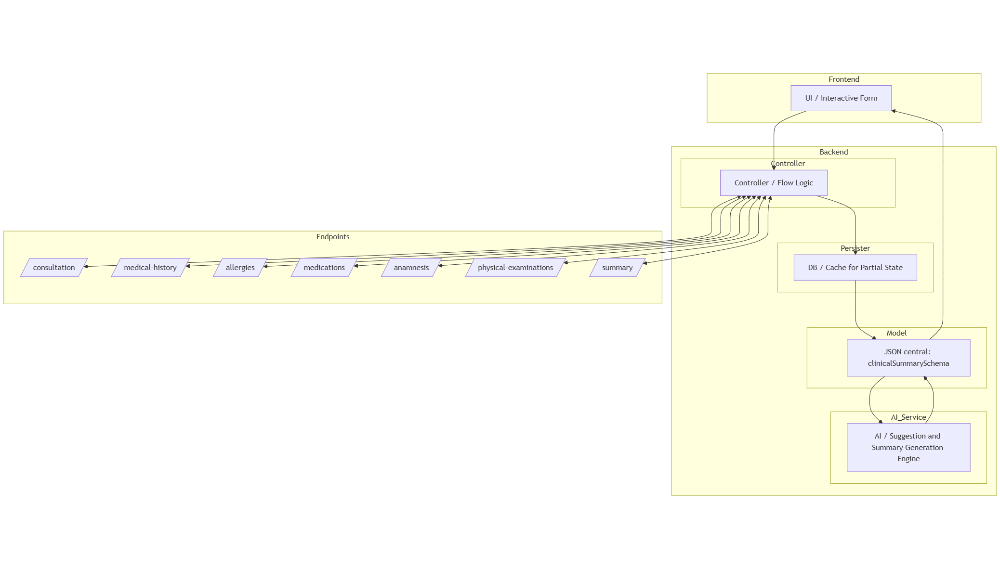

<div align="right">
  
</div>
<hr style="border-top: 2px solid #000;">

# Final Proyect ELIO

# Centro Asistencial Médica de Maldonado

## Project Technical Documentation

## Table of Contents

1. User Stories and Mockups
2. System Architecture
3. Components, Classes, and Database Design
4. Sequence Diagrams
5. API Specifications
6. Source Control Management (SCM) and Quality Assurance (QA) Strategies
7. Technical Justifications


## 1. User Stories and Mockups

### 1.1 Prioritized User Stories (MoSCoW)

#### Must Have

- As a physician, I need record my consultations in the most accessible, comfortable, and efficient way possible, to dedicate more time to the patient observation, rather than filling out forms.

### 1.2 Mockups

[Fig. 1 Elio UI](https://www.figma.com/proto/GKUrCkbEFd4LLeZqOR6X9h/Elio?node-id=147-368&p=f&t=OtDCn1gyjt3f2z4H-0&scaling=min-zoom&content-scaling=fixed&page-id=147%3A368)


## 2. System Architecture

### 2.1 Architecture Diagram


#### Fig. 2 Architecture Diagram

### 2.2 Component Description

| Componente | Tecnología | Descripción |
|-----|-----------|----------------------|
| Frontend   | [programa que usamos] | [Breve descripción del componente y su rol] |
| Backend    | [lenguaje usado] | [Breve descripción del componente y su rol] |
| Database | [tipo de base de datos usada] | [Breve descripción del componente y su rol] |
| External Services | [APIs usadas o todo lo externo usado] | [Breve descripción del componente y su rol] |

### 2.3 Data Flow

Tenemos que describir cómo fluyen los datos entre los diferentes componentes de nuestro sistema


## 3. Components, Classes, and Database Design

### 3.1 Main Components and Classes

#### Back-end
Listado y descripción de las clases principales, sus atributos y métodos

#### Front-end

Listado de los componentes principales de la interfaz de usuario y sus interacciones

### 3.2 Database Design

Elegir uno según lo que necesitemos, A o B, borrar la A o la B y dejar solamente la opción

#### Option A: ER Diagram (for relational databases)

Aquí ponemos un diagrama ER que muestre tablas, atributos y relaciones si existen


#### Option B: Collection Structure (for NoSQL databases)

**Collection: users**

```json
{
  "_id": "ObjectId",
  "name": "String",
  "email": "String",
  "password": "String (hashed)",
  "createdDate": "Date",
  "lastAccess": "Date"
}
```
si necesitan mas colecciones las siguen poniendo aca abajo especificando que tipo de colección es


## 4. Sequence Diagrams

### 4.1 Critical Use Case 1: Authentication Process (es un ejemplo)

Aquí ponemos un diagrama de secuencia para este caso de uso


### 4.2 Critical Use Case 2: New Resource Creation (otro ejemplo)

Aquí ponemos un diagrama de secuencia para este caso de uso


## 5. API Specifications

### 5.1 External APIs

| API | Purpose | Endpoints Used | Justification |
|-----|-----------|----------------------|---------------|
| [Nombre de API] | [Para qué se usa] | [Endpoints específicos] | [Por qué se eligió esta API] |

### 5.2 Internal API

#### Backend Endpoints

| Route | HTTP Method | Description | Input Parameters | Output Format |
|------|-------------|-------------|----------------------|-------------------|
| `/api/usuarios` | GET | Obtener lista de usuarios | `?limite=10&pagina=1` | ```json { "usuarios": [...], "total": 100 }``` |
| `/api/usuarios` | POST | Crear un nuevo usuario | ```json { "nombre": "...", "email": "...", "contraseña": "..." }``` | ```json { "id": "...", "nombre": "...", "email": "..." }``` |
| `/api/usuarios/:id` | GET | Obtener detalle de usuario | `id` en URL | ```json { "id": "...", "nombre": "...", "email": "..." }``` |


## 6. SCM and QA Strategies

### 6.1 Version Control Management (SCM)

#### Tool

- **System**: Git
- **Platform**: GitHub
- si tienen otras herramientas las van poniendo

#### Branch Strategy

- **main**: Código en producción
- **develop**: Código integrado para la próxima versión
- **feature/o el nombre**: Ramas para nuevas funcionalidades
- **hotfix/o el nombre**: Ramas para correcciones urgentes

#### Development Process

1. Crear una rama `feature/[nombre]` desde `develop`
2. Desarrollar la funcionalidad
3. Abrir Pull Request hacia `develop`
4. Revisión de código por al menos un miembro del equipo
5. Merge a `develop`
6. Pruebas en ambiente de staging
7. Merge a `main` para despliegue en producción
Este fue un ejemplo, ustedes van a poner lo que tiene Bruno, pero la idea es que usen la estructura.

### 6.2 Quality Assurance (QA)

#### Test Types

- **Unit Tests:** Para validar funciones y componentes individuales
- **Integration Tests:** Para validar interacciones entre componentes
- **API Tests:** Para validar endpoints y respuestas
- **UI Tests:** (si aplica) Para validar la interfaz de usuario
- **Acceptance Tests:** Para validar historias de usuario

#### Tools

- **Unit Tests:** [Ej: Jest, Mocha]
- **API Tests:** [Ej: Postman, Supertest]
- **UI Tests:** [Ej: Cypress, Selenium]
- **CI/CD:** [Ej: GitHub Actions, Jenkins]

#### Code Coverage

- Goal: > 80 % coverage in critical code
- [Which tools] will be used to measure coverage

#### QA Process

1. Execution of unit and integration tests on each commit
2. API and UI tests before each merge to develop
3. Critical manual tests before deployment to production
4. Performance review in regular cycles


## 7. Technical Justifications

### 7.1 Technology Choices

| Technology	| Alternatives Considered | Justification |
|----------|--------------|---------------|
| Para [Frontend] | [Alternativas] | [Razones para esta decisión] |
| Para [Backend] | [Alternativas] | [Razones para esta decisión] |
| Para [Database] | [Alternativas] | [Razones para esta decisión] |


### 7.2 Technology Choices

| Decision | Alternatives | Justification |
|-----|-----------|----------------------|
| [E.g.: Microservices architecture] | [E.g.: Monolith] | [Reasons for this decision] |
| [E.g.: JWT Authentication] | [E.g.: Sessions, OAuth] | [Reasons for this decision] |
Si tienen más van con esa estructura

### 7.3 Scalability and Maintenance Considerations

[Descripcion de como nuestr diseño técnico contempla el crecimiento futuro y facilita el mantenimiento de la aplicacióon]


**---**


## Appendices

### Glossary of Terms

| Term | Definition |
|---------|------------|
| [Término técnico] | [Definición de lo que es] |


### References

- [Lista de fuentes, documentación o estándares utilizados]
