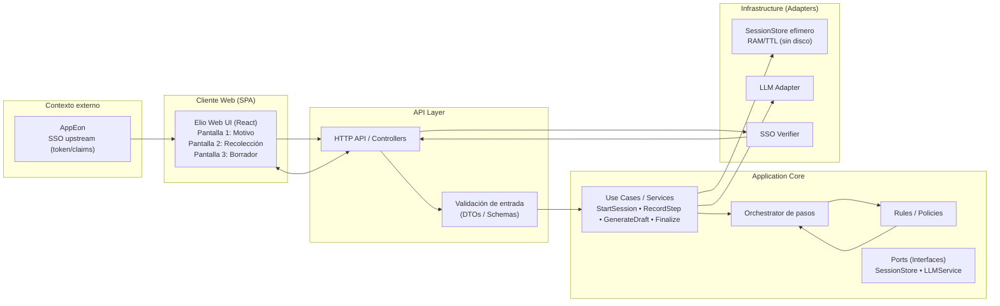
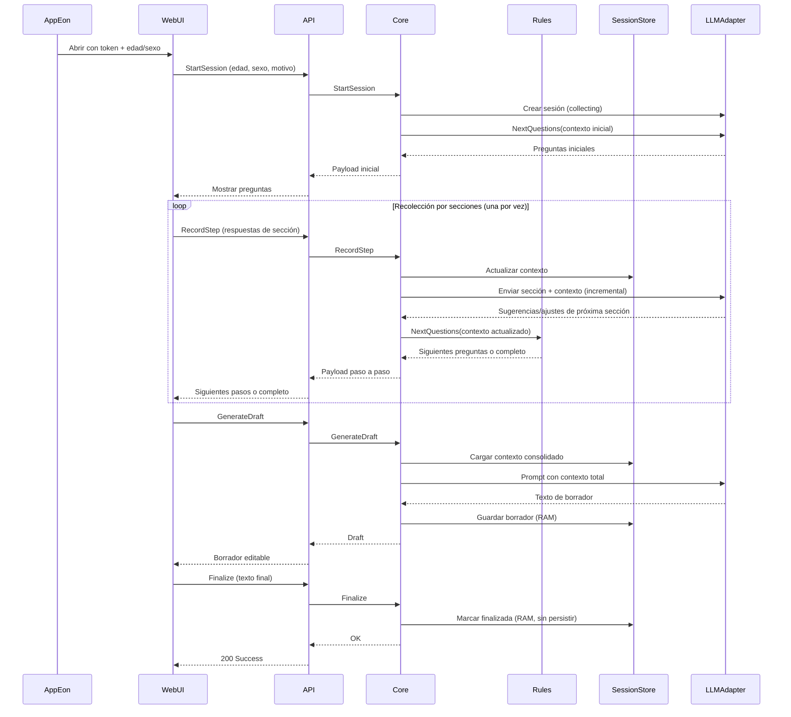

<div align="right">
  
</div>
<hr style="border-top: 2px solid #000;">

# Final Proyect ELIO

## Table of Contents

1. [User Stories and Mockups](#1-user-stories-and-mockups)
2. [System Architecture](#2-system-architecture)
3. [Components, Classes, and Database Design](#3-components-classes-and-database-design)
4. [Sequence Diagrams](#4-sequence-diagrams)
5. [API Specifications](#5-api-specifications)
6. [Source Control Management (SCM) and Quality Assurance (QA) Strategies](#6-scm-and-qa-strategies)
7. [Technical Justifications](#7-technical-justifications)


## 1. User Stories and Mockups

### 1.1 Prioritized User Stories (MoSCoW)

#### Must Have

- As a physician, I need record my consultations in the most accessible, comfortable, and efficient way possible, to dedicate more time to the patient observation, rather than filling out forms.

### 1.2 Mockups

[Fig. 1 Elio UI](https://www.figma.com/proto/GKUrCkbEFd4LLeZqOR6X9h/Elio?node-id=147-368&p=f&t=OtDCn1gyjt3f2z4H-0&scaling=min-zoom&content-scaling=fixed&page-id=147%3A368)


## 2. System Architecture

### 2.1 Architecture Diagram

##### Fig. 2 Architecture Diagram



### 2.2 Component Description

| Componente | Tecnología | Descripción |
|-----|-----------|----------------------|
| Frontend   | [Angular (Web - Framework)] | [SPA - Single Page Application] |
| Backend    | [Node.js] | [Server Technology] |
| Database | [MongoDB] | [Database para cargar datos de SNOMED CT & VADEMECUM] |
| External Services | [Gemini 2.5 & MongoDB] | [Api para redaccion y generacion de opciones & MongoDB para consultar datos] |

## 3. Components, Classes, and Database Design

### 3.1 Main Components and Classes

#### Back-end
Listado y descripción de las clases principales, sus atributos y métodos

#### Front-end

Listado de los componentes principales de la interfaz de usuario y sus interacciones

### 3.2 Database Design

Elegir uno según lo que necesitemos, A o B, borrar la A o la B y dejar solamente la opción

#### Option A: ER Diagram (for relational databases)

Aquí ponemos un diagrama ER que muestre tablas, atributos y relaciones si existen


#### Option B: Collection Structure (for NoSQL databases)

**Collection: users**

```json
{
  "_id": "ObjectId",
  "name": "String",
  "email": "String",
  "password": "String (hashed)",
  "createdDate": "Date",
  "lastAccess": "Date"
}
```
si necesitan mas colecciones las siguen poniendo aca abajo especificando que tipo de colección es


## 4. Sequence Diagrams

### 4.1 Create medical note




## 5. API Specifications

### 5.1 External APIs

| API | Purpose | Endpoints Used | Justification |
|-----|-----------|----------------------|---------------|
| [Nombre de API] | [Para qué se usa] | [Endpoints específicos] | [Por qué se eligió esta API] |

### 5.2 Internal API

#### Backend Endpoints

| Route | HTTP Method | Description | Input Parameters | Output Format |
|------|-------------|-------------|----------------------|-------------------|
| `/api/usuarios` | GET | Obtener lista de usuarios | `?limite=10&pagina=1` | ```json { "usuarios": [...], "total": 100 }``` |
| `/api/usuarios` | POST | Crear un nuevo usuario | ```json { "nombre": "...", "email": "...", "contraseña": "..." }``` | ```json { "id": "...", "nombre": "...", "email": "..." }``` |
| `/api/usuarios/:id` | GET | Obtener detalle de usuario | `id` en URL | ```json { "id": "...", "nombre": "...", "email": "..." }``` |


## 6. SCM and QA Strategies

### 6.1 Version Control Management (SCM)

#### Tool
- **System**: Git  
- **Platform**: GitHub  

#### Branch Strategy
- **main (Ask):** Contains only approved code ready for deployment.  
- **develop (Ask):** Integration branch where the complete system is reviewed before moving to production.  
- **test (Show):** Testing branch where backend and frontend are integrated to validate joint functionality.  
- **backend (Show):** Backend working branch where API progress is shown.  
- **frontend (Show):** Frontend working branch where interface progress is shown.  
- **feature/[name] (Ship):** Temporary sub-branches to implement specific features (e.g., `feature/login-backend`, `feature/dashboard-frontend`).  

#### Development Process
1. Create a `feature/[name]` branch from `backend` or `frontend`.  
2. Develop the feature and make descriptive commits.  
3. Merge into `backend` or `frontend` (Show).  
4. Integrate into `test` (Show) to validate backend + frontend together.  
5. Merge into `develop` (Ask), subject to code review.  
6. Manual QA and critical validations in `develop`.  
7. Final merge into `main` (Ask) for production deployment.  

#### Rules
- Never merge Show branches directly into `main`.  
- All merges into `develop` and `main` must be done via Pull Requests on GitHub with peer review.  
- Commits must be descriptive and follow a consistent format.  
- `main` must always be stable and ready for immediate deployment.  

---

### 6.2 Quality Assurance (QA)

#### Test Types
- **Unit Tests:** Validate critical backend and frontend functions and classes.  
- **Integration Tests:** Validate interaction between backend and frontend in the `test` branch.  
- **API Tests:** Validate endpoints using dedicated tools.  
- **UI Tests:** Validate user interface flows.  
- **Manual QA:** Review of critical use cases in `develop`.  
- **Code Reviews:** All Pull Requests into Ask branches (`develop` and `main`) must be approved by at least one other team member.  

#### Tools
- **Backend (Unit Tests):** Jest / Mocha  
- **Frontend (UI/Integration):** React Testing Library / Cypress  
- **API Testing:** Postman / Thunder Client  
- **CI/CD:** GitHub Actions to run automated tests on every Pull Request  

#### Code Coverage
- **Goal:** >80% coverage in critical code.  
- **Tools:** Jest (coverage report) and Cypress (for e2e).  

#### QA Process
1. Automatic execution of unit tests on every push to a sub-branch (Ship).  
2. Integration tests when merging into `backend`/`frontend` (Show).  
3. API and UI tests in `test` before merging into `develop`.  
4. Manual QA and mandatory code review in `develop`.  
5. Merging into `main` triggers automatic deployment to production if all validations pass.  

## 7. Technical Justifications

### 7.1 Technology Choices

| Technology	| Alternatives Considered | Justification |
|----------|--------------|---------------|
| Para [Angular] | [React] | [Angular provides more scalability] |
| Para [Node.js] | [Python & Fastapi] | [Frontend and backend are created in a single languaje] |

### 7.2 Technology Choices

| Decision | Alternatives | Justification |
|-----|-----------|----------------------|
| [MCP Architecture] | [Monolith Architecture] | [Separation of flow control, state and persistence for more scalability] |
| [Jwt Authentication] | [None] | [Technology that we know how to handle] |

### 7.3 Scalability and Maintenance Considerations

[Interface - Angular: Their premise is to be scalable and maintainable]
[Backend - Node.js: Having all the codebase in JS - TS makes the code easier to work with, given that it's on a single language]

**---**


## Appendices

### Glossary of Terms

| Term | Definition |
|---------|------------|
| [Término técnico] | [Definición de lo que es] |


### References

- [Lista de fuentes, documentación o estándares utilizados]
