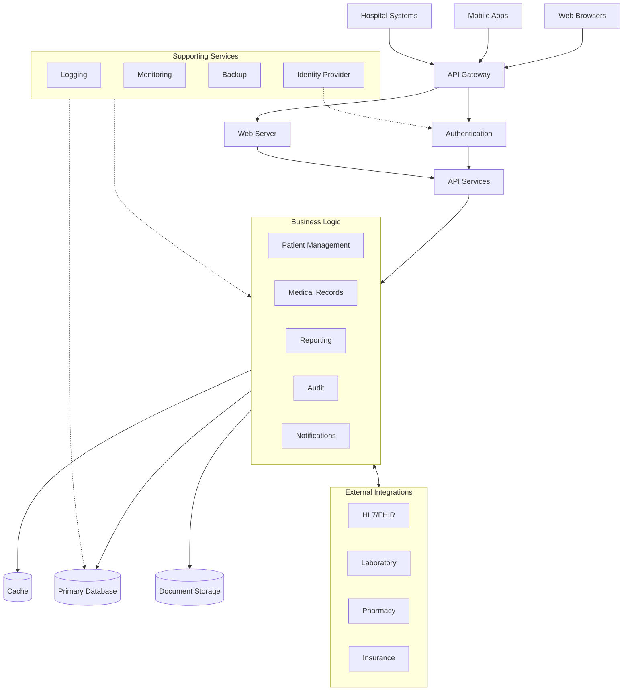

# ELIO: System Architecture

## Overview
This document outlines the technical architecture of the ELIO medical records system, providing a comprehensive view of how the system components interact to deliver secure, efficient, and compliant medical record management.

## Architecture Diagram

# ELIO: System Architecture

## System Components

### Application Layers

#### Presentation Layer
- **API Gateway**: Handles all incoming requests, provides TLS termination, rate limiting, and request routing
- **Authentication Service**: Manages user authentication, issues JWTs, and validates credentials
- **API Controllers**: RESTful endpoints that accept and respond to client requests

#### Business Logic Layer
- **Patient Service**: Handles patient data operations, validation, and business rules
- **Medical Record Service**: Manages the creation, retrieval, and modification of medical records
- **Reporting Service**: Generates reports and analytics from system data
- **Audit Service**: Records all system actions for compliance and security purposes
- **Notification Service**: Manages alerts and notifications to users

#### Data Access Layer
- **Repository Pattern Implementation**: Abstracts database operations from business logic
- **Data Validation**: Ensures data integrity before persistence
- **Query Optimization**: Implements efficient data access patterns
- **Caching Strategy**: Reduces database load for frequently accessed data

#### Infrastructure Layer
- **Logging Framework**: Captures system events and errors
- **Configuration Management**: Manages environment-specific settings
- **Exception Handling**: Provides consistent error management
- **Security Middleware**: Implements authentication and authorization checks

#### Indexing Strategy
- Patient identification number
- Provider identification
- Timestamp-based indexes for medical records
- Full-text search indexes for clinical notes
- Compound indexes for common query patterns

#### Data Partitioning
- Time-based partitioning for historical records
- Sharding strategy for high-volume deployments
- Archive policy for inactive patient data

### Integration Points

#### Third-party Services
- **Identity Provider**: OAuth 2.0 / OpenID Connect services
- **Medical Terminology Service**: ICD-10, SNOMED CT integration
- **Document Processing Service**: For handling uploaded documents

#### Health System Integrations
- **EHR Systems**: Bidirectional data exchange
- **Laboratory Information Systems**: Test ordering and result retrieval
- **Radiology Information Systems**: Imaging order and result management
- **Pharmacy Systems**: Prescription transmission

## Scalability Design

### Load Balancing
- Application-level load balancing using Nginx/HAProxy
- Distribution algorithms: round-robin with health checks
- Session affinity configuration

### Horizontal Scaling
- Stateless application server design
- Auto-scaling based on CPU/memory metrics
- Containerization with Docker and Kubernetes

### Database Scaling
- Read replicas for query-intensive operations
- Vertical scaling for write operations
- Sharding for very large datasets
- Caching layer using Redis/Memcached

## Availability and Redundancy

### Failover Mechanisms
- Active-passive database configuration
- Automatic failover with minimal downtime
- Health monitoring and self-healing capabilities

### Backup Strategies
- Daily full database backups
- Hourly incremental backups
- Point-in-time recovery capabilities
- Geographically distributed backup storage

### Disaster Recovery Plan
- Recovery Time Objective (RTO): 2 hours
- Recovery Point Objective (RPO): 15 minutes
- Regular disaster recovery testing
- Documented recovery procedures

## Security Architecture

### Authentication Flow
1. User provides credentials
2. Authentication service validates credentials
3. JWT token issued with appropriate claims
4. Token validation on subsequent requests
5. Refresh token mechanism for session continuity

### Authorization Model
- Role-Based Access Control (RBAC)
- Fine-grained permissions for medical records
- Context-aware authorization (patient-provider relationship)
- Principle of least privilege enforcement

### Data Encryption
- Data-at-rest encryption
- TLS 1.3 for data-in-transit
- Field-level encryption for highly sensitive data
- Secure key management system

### Audit Mechanisms
- Comprehensive action logging
- Tamper-evident audit trail
- Real-time suspicious activity detection
- Compliance reporting capabilities

## Performance Considerations

### Caching Strategies
- Application-level caching for reference data
- Database query caching
- HTTP response caching with appropriate cache headers
- Distributed caching for session data

### Performance Optimization
- Database query optimization
- Asynchronous processing for non-critical operations
- Connection pooling
- Resource compression

### Expected Load Parameters
- Concurrent users: Up to 500
- Average request rate: 50 requests/second
- Peak request rate: 200 requests/second
- Average response time: < 200ms
- Storage growth rate: ~100GB/year

## Deployment Architecture

### Development Environment
- Local developer environments
- CI/CD pipeline integration
- Automated testing environment

### Staging Environment
- Production-like configuration
- Data anonymization for testing
- Performance testing capabilities

### Production Environment
- High-availability configuration
- Enhanced security measures
- Comprehensive monitoring

## Monitoring and Observability

### System Metrics
- Server health (CPU, memory, disk)
- Application performance metrics
- Database performance metrics
- API endpoint response times

### Application Insights
- Error tracking and aggregation
- User behavior analytics
- Feature usage statistics
- Performance bottleneck identification

### Alerting Strategy
- Threshold-based alerts
- Anomaly detection
- On-call rotation
- Incident management workflow